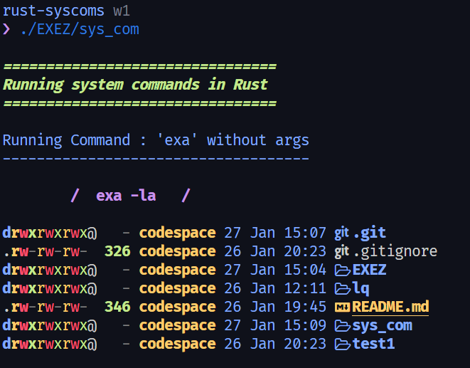

<h2 align="center"><code> sys_comm </code></h2>
<h3 align="center"><i> Testing Actual System Commands  </i></h3>

----
1. [WTF](#wtf)
   1. [Sources](#sources)
2. [Syntax](#syntax)
   1. [Ouput Pic](#ouput-pic)


----

# WTF 

1. Going to test actual system commands in this directory 

## Sources 

[`https://doc.rust-lang.org/std/process/struct.Command.html`](https://doc.rust-lang.org/std/process/struct.Command.html)
- From the offciail manual to access system commands 
  
# Syntax 

1. After following the above fucked up texts the following was used for invoking the command and its arguments 

```rs
.
.

let mut l_exa = Command::new("exa");
        l_exa
            .args(["-la", "--icons"])
            .status()
            .expect("fucking idiot");
.
.

```
- this is a nice short hand method of invoking a command and is arguments 
- Have to find out how to store the output and write files with this method 

## Ouput Pic 

